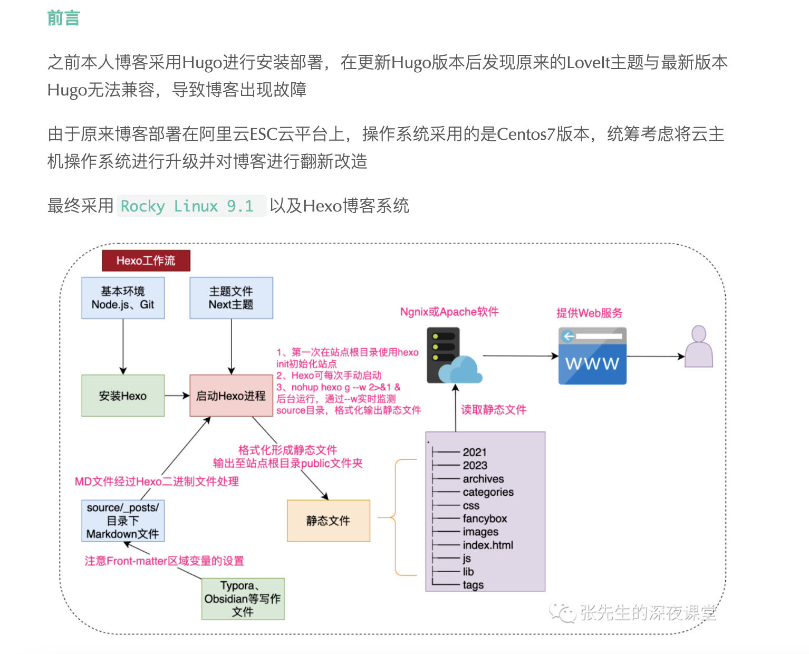

   

使用Hexo的大致流程为：
1.安装依赖环不境 (Node.js和 Git)
1. 安装Hexo
2. 创建博客项目
3. 添加文章
4. 修改配置（主题、网站信息等）
5. 生成网页
7.部署

自定义配置
••站点配置：根目录下 config. yml 文件；
•主题配置：主题根目录下_config- yml 文件；
心得体会

安装
•cit：官网
• Nodejs： 官网
• Hexo: npm install -g hexo-cli
使用
。初始化：npm init
•安装模块：npm instal1
•新文章：hexo newmm
•清除生成：hexo clean
•生成页面：hexo g
•启动服务：hexos
。部署：hexo d
%. Mculover556

基本配置
•域名：mculover666.cn
•国内分流：mculover666.coding.me
•境外分流：mculover666.github.io
。平台：Coding + Github双平台部署
。框架：Hexo v3.8.0
•主题：Next.Pisces v7.1.1
•评论系统：Valine
。搜索服务：Local Search
•站点统计：不蒜子
。数据统计：百度统计
。内容分享：百度分享
•公式服务：MathJax
。音乐服务：网易云音乐
•。背景效果：点击鼠标浮现爱心＋社会主义核心价值观

正文
如何搭建
先用hexo搭建一个本地的博客网站
hexo官网 写的非常详细。一说到看官方文档就想到尤大说的一句话：〞对于学习技术而言，看官方文档就完全足够了，但是很多人就是不看〞。对此，我只想说确实是这样，但是有个前提是你得先对这个技术有个大概的了解，所以我通常会先看下别人出的教程，看下别人写的demo，再回过头来看官方文档。
官方文档中详细描述了整个过程：安装-＞初始化一＞启动一＞部署。
•安装hexo脚手架：
§ npm instal1 hexo-cli -g
• #Jt#lthexomE:
$ hexo init blog $ ed blog
§ nom install
•启动hexo项目：
§ hexo server
然后你就可以看到如下效果：

搭建歩骤
环境搭建
•安装node.js
•安装git
•安装Hexo
•初始化Hexo
•构建Hexo
•启动Hexo内建服务器
部署Hexo到远程平台
•GitHub创建仓库
•安装hexo-deployer-git
•修改本地配置文件
•github SSH的配置
•复制密钥到github
•验证是否配置成功
•访问自己的博客

hexo安装中出现的问题
1.出错描述
node: relocation error: node: symbol ssI_set_cert_cb, version 1ibss1 .so .:
亲测有效：解决方案
2.万能方法
回使用搜索引擎，如百度，Google（建议自己搭梯子）等，很大一部分问题都能得到解决；
回学会读异常，如在配置_contig yml文件时，经常会因为没有输入空格，导致网站无法显示，但是在hexog是会提示第几行第几列出错的，要注意仔细阅读，并以此类推。
◎上面两种方法均无法解决问题，试了很多方法并不能奏效时，可是尝试向朋友或者相关博客中的作者提问，得到解决方案，做技术的在有人向他提问题时，除非是不动脑子的问题，一般都会回答你。如果大家在博客搭建中有相关问题，我们也可以一起讨论，文后有我公众号地址。